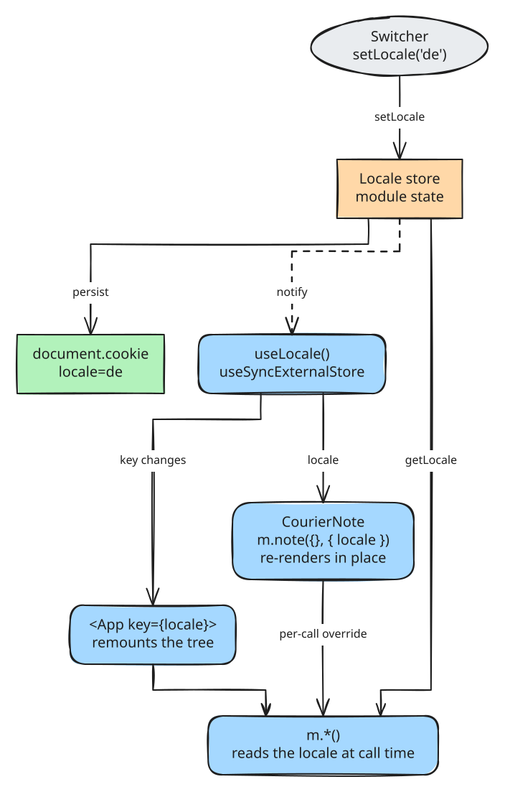

import { Aside } from '@astrojs/starlight/components'
import LanguageDemo from '../../../components/LanguageDemo.astro'

```ts title="src/loclizr/messages.d.ts"
export type AppLocale = 'de' | 'de-AT' | 'en'

export declare function getLocale(): AppLocale
export declare function setLocale(locale: AppLocale, options?: SetLocaleOptions): void
export declare function subscribe(listener: () => void): () => void
export { locales, sourceLocale } from './messages/_locale.js'
```

The barrel re-exports the one store in `loclizr`, narrowed to your locales. Outside React, use
`subscribe` directly; it returns its remover.

```tsx title="src/Switcher.tsx"
import { useLocale } from 'loclizr/react'
import * as m from './loclizr/messages'

const offered = [m.sourceLocale, ...m.locales.filter((tag) => tag !== m.sourceLocale)]

export function Switcher() {
  const locale = useLocale()
  const names = new Intl.DisplayNames([locale], { type: 'language' })
  return (
    <div className="switcher">
      {offered.map((tag) => (
        <button key={tag} type="button" aria-pressed={tag === locale} onClick={() => m.setLocale(tag)}>
          {names.of(tag) ?? tag}
        </button>
      ))}
    </div>
  )
}
```

`m.locales` is the frozen tuple `['de', 'de-AT', 'en']`; `m.sourceLocale` is `'en'`.

## How the locale is resolved

First match wins:

1. An active server request scope.
2. What `setLocale` stored.
3. With a DOM, detected once: the cookie, then `<html lang>`.
4. The source locale.

Matching is exact, then by cutting subtags (`de-CH` to `de`). An unknown tag, such as a cookie
edited to `sp`, renders the source locale, never `undefined`.

<Aside type="note">
Detection never reads `navigator.languages` or `localStorage`: a server sees neither, so hydration
would switch language.
</Aside>

### First visit on a static site

```tsx title="src/main.tsx"
import * as m from './loclizr/messages'

function pickFirstLocale(): void {
  const chosen = document.cookie.split(';').some((pair) => pair.trim().startsWith('locale='))
  if (chosen) return
  for (const tag of navigator.languages) {
    const wanted = tag.toLowerCase()
    const language = wanted.split('-')[0]
    const match =
      m.locales.find((known) => known.toLowerCase() === wanted) ??
      m.locales.find((known) => known.toLowerCase() === language)
    if (match !== undefined) {
      m.setLocale(match)
      return
    }
  }
}

pickFirstLocale()
```

With no server, a first visit renders the source locale. v0.1 leaves that gap to you; this helper
closes it:

- Call it before the first render.
- It picks the first browser language in `m.locales`: exact tag (`de-AT`), then language subtag
  (`de-CH` to `de`).
- It does nothing once a cookie is set. `locale=` is the default name; match your `cookie` setting.
- `setLocale(match)` persists, so a later browser language change is not re-detected.
  `{ persist: false }` re-detects each visit until the visitor picks.

<Aside type="caution">
Not `negotiate`: `loclizr/server` imports `node:async_hooks` and does not bundle for the browser.
</Aside>

## Persistence

`setLocale('de')` writes the cookie (`cookie` in `loclizr.config.ts`, default `locale`), sets
`document.documentElement.lang`, then notifies subscribers. The cookie is the only persistence,
since a server reads it back.

| Case | Effect |
| --- | --- |
| `{ persist: false }` | this page load only |
| No `document`, React Native included | memory only, subscribers still notified |

Cookie attributes are fixed in v0.1: `path=/`, `max-age` one year, `SameSite=Lax`, no `Domain`, no
`Secure`. No `Domain` means host-scoped: `shop.example.com` and `help.example.com` do not share a
choice.

`setLocale` never sets `dir`; for an RTL locale set it yourself from `useLocale()` or a `subscribe`
listener.

After a reload following a persisted switch, a client-only app warns once outside production:
`<html lang="en"> disagrees with the resolved locale "de"`. The hook already fixed `lang`, so ignore
it; [React](/guides/react/) has the server-side fix.

<Aside type="caution">
`setLocale` throws inside a server request scope:

```text
loclizr: setLocale() cannot run inside a request scope. Pass { locale } per call instead.
```

[Server rendering](/guides/server-rendering/) has the per-request shape.
</Aside>

## The per-call override

```ts
m.cart_items({ count: 3 }, { locale: 'de' })   // "3 Artikel in deinem Warenkorb"
```

A second-argument `{ locale }` beats the store for that call. The switcher below works this way, so the
page around it keeps its own language:

<LanguageDemo />

## What re-renders, and what does not

<figure class="diagram">



</figure>

Generated code imports nothing from React, so a component that only calls messages updates when its
parent next renders:

| Pattern | On a switch | Local state |
| --- | --- | --- |
| Key the root on the locale | subtree remounts, every string recomputed | lost below the key |
| Pass `{ locale }` per call | component re-renders in place | kept |

Combine them: key the root for the bulk, pass per call where state must survive.

### Key the root on the locale

```tsx title="src/main.tsx"
function Shop() {
  const locale = useLocale()
  const [cart, setCart] = useState(openingCart)
  return (
    <>
      <App key={locale} cart={cart} onChange={(patch) => setCart((current) => ({ ...current, ...patch }))} />
      <CourierNote />
    </>
  )
}
```

`cart` survives the remount because it lives above the key, in `Shop`; `App`'s own `useState`
would not.

### Pass the locale per call

```tsx title="src/CourierNote.tsx"
export function CourierNote() {
  const locale = useLocale()
  const [note, setNote] = useState('')
  return (
    <section className="note">
      <label htmlFor="note">{m.app_note({}, { locale })}</label>
      <textarea id="note" value={note} placeholder={m.app_notePlaceholder({}, { locale })} onChange={(event) => setNote(event.target.value)} />
      <p>{m.app_noteKeeps({}, { locale })}</p>
    </section>
  )
}
```

`CourierNote`, outside the key, re-renders in place and keeps the typed note. [React](/guides/react/)
has the React Compiler reason for this form.
